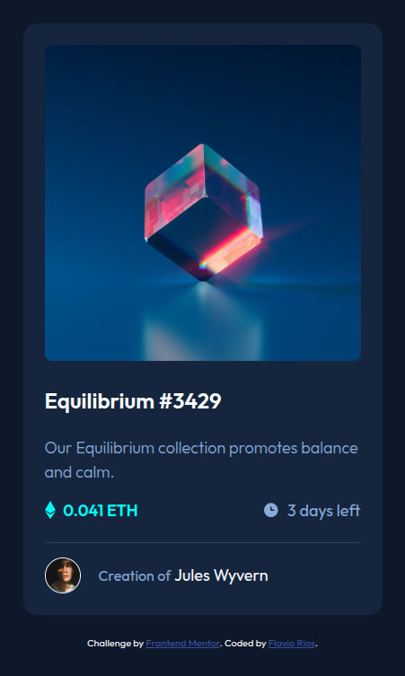

# Frontend Mentor - NFT Preview Card Component

## Table of Contents

- [Overview](#overview)
  - [The challenge](#the-challenge)
  - [Screenshot](#screenshot)
  - [Links](#links)
- [My process](#my-process)
  - [Built with](#built-with)
  - [What I learned](#what-i-learned)
  - [Continued development](#continued-development)
  - [Useful resources](#useful-resources)
- [Author](#author)
- [Acknowledgments](#acknowledgments)

## Overview

This is a solution to the [NFT preview card component challenge on Frontend Mentor](https://www.frontendmentor.io/challenges/nft-preview-card-component-SbdUL_w0U). The goal was to create a responsive NFT card with hover effects and semantic HTML structure.

### The challenge

Users should be able to:
- View the optimal layout depending on their device's screen size
- See hover states for interactive elements

### Screenshot

### Links

- [Live Site URL](https://flaviovich.github.io/frontendmentor-nft-preview-card-component/)

## My process

### Built with

- Semantic HTML5 markup
- CSS custom properties
- Flexbox
- Mobile-first workflow

### What I learned

- Improved semantic HTML structure using section, article, header, and footer elements.
- Enhanced accessibility with ARIA attributes and descriptive alt text.
- Responsive design using CSS custom properties and media queries.
- **Note:** I was unable to change the color of `icon-view.svg` to white using CSS filters. The icon remains in its original color.

### Continued development

- Explore better ways to manipulate SVG colors for icons.
- Further improve accessibility and keyboard navigation.
- Experiment with CSS Grid for more complex layouts.

### Useful resources

- [MDN Web Docs](https://developer.mozilla.org/en-US/)
- [CSS Tricks: CSS Filters](https://css-tricks.com/almanac/properties/f/filter/)
- [Frontend Mentor](https://www.frontendmentor.io/)

## Author

- Website - [Flavio Rios](https://www.linkedin.com/in/flavio-rios-nieto/)
- Frontend Mentor - [@flaviovich](https://www.frontendmentor.io/profile/flaviovich)

## Acknowledgments

Thanks to Frontend Mentor for the challenge and the community for inspiration and feedback.
