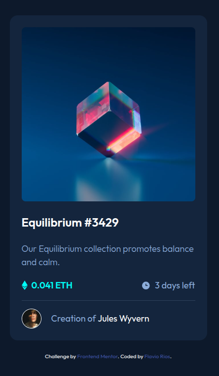

# Frontend Mentor - NFT Preview Card Component Solution

This is a solution to the [NFT preview card component challenge on Frontend Mentor](https://www.frontendmentor.io/challenges/nft-preview-card-component-SbdUL_w0U). Frontend Mentor challenges help you improve your coding skills by building realistic projects.

## Table of Contents

- [Overview](#overview)
  - [The challenge](#the-challenge)
  - [Screenshot](#screenshot)
  - [Links](#links)
- [My process](#my-process)
  - [Built with](#built-with)
  - [What I learned](#what-i-learned)
  - [Continued development](#continued-development)
  - [Useful resources](#useful-resources)
- [Author](#author)
- [Acknowledgments](#acknowledgments)

## Overview

### The Challenge

Users should be able to:

- View the optimal layout depending on their device's screen size
- See hover states for interactive elements
- Experience smooth transitions and animations
- Navigate through the component using keyboard controls for accessibility

### Screenshot



*Screenshot showing the NFT preview card with hover effects and responsive design*

### Links

- Solution URL: [GitHub Repository](https://github.com/flaviovich/frontendmentor-nft-preview-card)
- Live Site URL: [Live Demo](https://flaviovich.github.io/frontendmentor-nft-preview-card)

## My Process

### Built With

- **Semantic HTML5** markup for better accessibility and SEO
- **CSS Custom Properties** using Tailwind CSS v4 theme configuration
- **Tailwind CSS v4** - Modern utility-first CSS framework
- **Flexbox** for layout and alignment
- **Mobile-first workflow** ensuring responsive design
- **CSS Flexbox** for component layout
- **Custom hover effects** with smooth transitions
- **Accessibility features** including ARIA labels and focus states

### What I Learned

During this project, I enhanced my skills in several key areas:

#### 1. Modern Tailwind CSS v4 Features
I learned to use Tailwind CSS v4's new `@theme` directive for defining custom design tokens:

```css
@theme {
  --color-blue500: hsl(215, 51%, 70%);
  --color-cyan400: hsl(178, 100%, 50%);
  --color-blue950: hsl(217, 54%, 11%);
  --color-blue900: hsl(216, 50%, 16%);
  --color-blue800: hsl(215, 32%, 27%);
  --font-outfit: 'Outfit', system-ui, sans-serif;
}
```

#### 2. Advanced CSS Hover Effects
I implemented a sophisticated image overlay effect using CSS transforms and opacity:

```html
<div class="absolute inset-0 bg-cyan400 flex justify-center items-center opacity-0 transition-opacity duration-300 ease-in-out rounded-lg group-hover:opacity-50">
  
</div>
```

#### 3. Accessibility Best Practices
I incorporated proper ARIA labels, semantic HTML, and keyboard navigation:

```html
<div class="flex justify-between" role="group" aria-label="NFT details">
  <!-- NFT details content -->
</div>
```

#### 4. Responsive Design with Clamp()
I used CSS clamp() function for fluid typography:

```html
<h2 class="text-white text-[clamp(1.25rem,4vw,1.5rem)] font-semibold">
  Equilibrium #3429
</h2>
```

### Continued Development

In future projects, I want to continue focusing on:

- **Advanced CSS animations** and micro-interactions
- **Component-based architecture** using frameworks like React or Vue
- **Advanced accessibility features** such as screen reader optimization
- **Performance optimization** techniques including lazy loading and image optimization
- **CSS Grid** for more complex layouts
- **Dark/light mode** implementation with CSS custom properties

### Useful Resources

- [Tailwind CSS v4 Documentation](https://tailwindcss.com/docs) - Helped me understand the new features and theme configuration
- [MDN Web Docs - CSS Transitions](https://developer.mozilla.org/en-US/docs/Web/CSS/CSS_Transitions) - Great resource for understanding smooth transitions
- [Web Accessibility Initiative (WAI)](https://www.w3.org/WAI/) - Comprehensive guide for implementing accessibility features
- [CSS-Tricks - A Complete Guide to Flexbox](https://css-tricks.com/snippets/css/a-guide-to-flexbox/) - Excellent reference for flexbox layouts
- [Google Fonts - Outfit](https://fonts.google.com/specimen/Outfit) - Typography resource for the project

## Author

- **Name**: Flavio Rios
- **Frontend Mentor**: [@flaviovich](https://www.frontendmentor.io/profile/flaviovich)
- **LinkedIn**: [Flavio Rios Nieto](https://www.linkedin.com/in/flavio-rios-nieto/)
- **GitHub**: [@flaviovich](https://github.com/flaviovich)

## Acknowledgments

- Thanks to **Frontend Mentor** for providing this challenging and educational project
- Appreciation to the **Tailwind CSS team** for creating such a powerful and intuitive framework
- Gratitude to the **web development community** for sharing knowledge and best practices
- Special thanks to accessibility advocates who emphasize the importance of inclusive web design

---

## Getting Started

To run this project locally:

1. Clone the repository:
   ```bash
   git clone https://github.com/flaviovich/frontendmentor-nft-preview-card.git
   ```

2. Navigate to the project directory:
   ```bash
   cd frontendmentor-nft-preview-card
   ```

3. Install dependencies:
   ```bash
   npm install
   ```

4. Start the development server:
   ```bash
   npm run dev
   ```

5. Open `index.html` in your browser or use a live server extension

## Project Structure

```
nft-preview-card-component/
├── index.html
├── src/
│   ├── input.css
│   └── output.css
├── assets/
│   └── images/
│       ├── image-equilibrium.jpg
│       ├── image-avatar.png
│       ├── icon-ethereum.svg
│       ├── icon-clock.svg
│       └── icon-view.svg
├── package.json
└── README.md
```